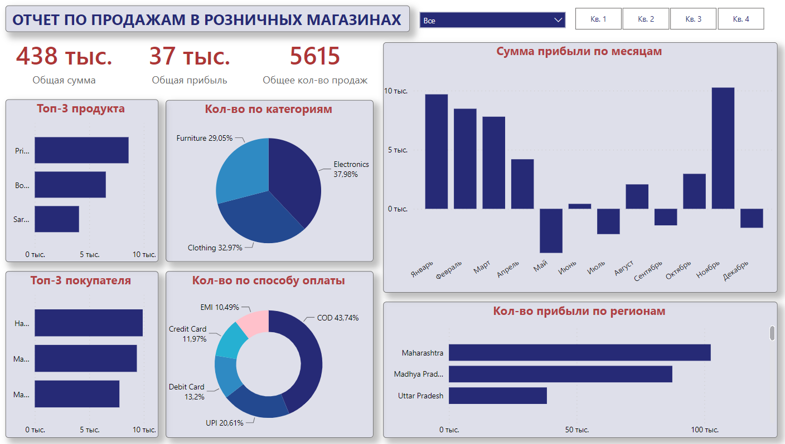

# Dashboard Отчет по продажам в розничных магазинах Индии

Реализовано в Power BI на основе данных магазина, которые я собрала с Kaggle.

### Цель проект 
___
Разработка отчета о продажах в розничном магазине, который предоставляет четкий и лаконичный обзор показателей продаж магазина, позволяя владельцу получить практические выводы.

### Состав отчета, которым можно управлять
___

- Отчет может быть нарезан по кварталам года.

- Отчет может быть нарезаны по районам Индии.

- В карточках, указана:
    - Общую сумма, 
    - Общая прибыль, 
    - Общее количество продаж.

- Отчет имеет гистограмму, показывающую общую прибыль по месяцам.

- Отчет имеет горизонтальную гистограмму, показывающуя количество прибыли по регионам

- Отчет имеет горизонтальную гистограммы:
    - Топ-3 Продукта
    - Топ-3 Покупателя

- Отчет имеет круговую диаграмму, показывающуя сумму прибыли по подкатегория
- Отчет имеет кольцевую диаграмму, показывающуя какое количество товара было заказано через какой способ оплаты.

## Ссылка на датасет
[Retail Sales Dataset](./Dataset/)

